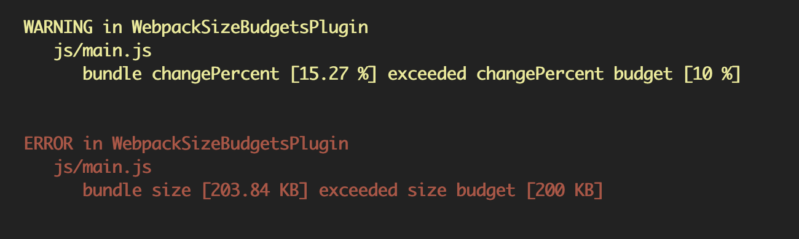
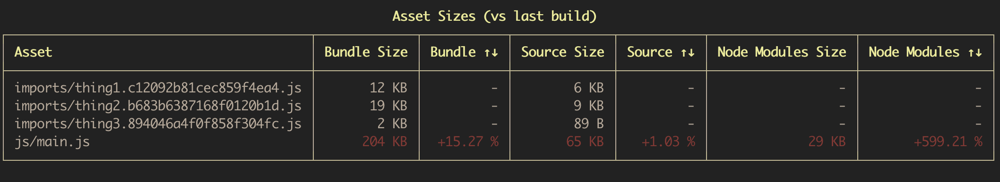
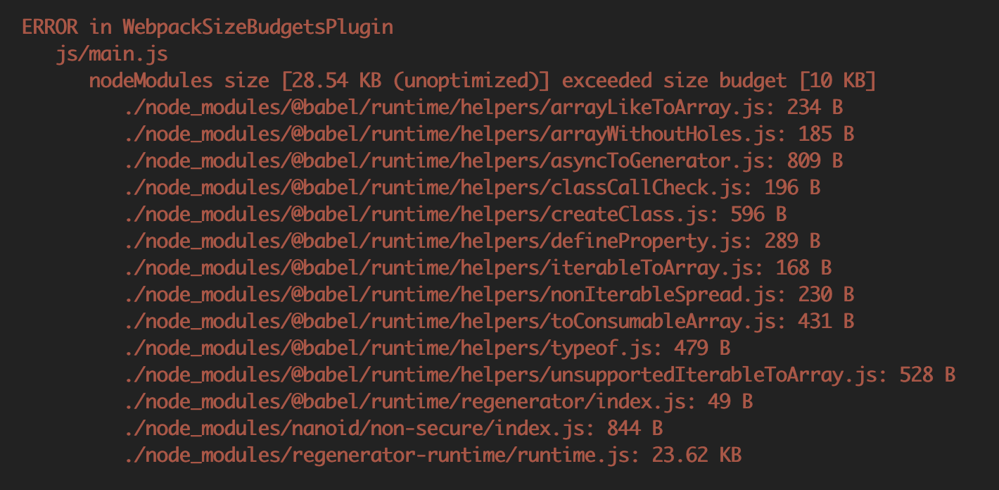

# webpack-size-budgets-plugin

Warn or error when bundle assets exceed thresholds in size, percentChange, node_modules size, etc.



## Install
```
$ npm install webpack-size-budgets-plugin --save-dev
```

## Add Plugin to Webpack
webpack.config.js
```js
const WebpackSizeBudgetsPlugin = require('webpack-size-budgets-plugin');

module.exports = {
    plugins: [
        new WebpackSizeBudgetsPlugin({
            'js/main.js': '25 KB',
            'imports/**': '10 KB',
        }),
    ],
};
```

## Config
The plugin can be customized for many uses...
```js
new WebpackSizeBudgetsPlugin({
    printReport: true,
    saveHistory: true,
    severity: 'ERROR',
    budgets: {
        'js/foo.js': [
            // error if the foo.js bundle is greater than 200KB
            { type: 'bundle', attribute: 'size', threshold: '200 KB' },

            // warn if the foo.js bundle has increased by more than 10%
            { type: 'bundle', attribute: 'changePercent', threshold: 10, severity: 'WARN' },

            // log a message if the source code used in foo.js has increased by more than 2KB
            { type: 'source', attribute: 'changeAmount', threshold: '2 KB' severity: 'INFO' },

            // error if the node modules included in foo.js total more than 10KB
            { type: 'nodeModules', attribute: 'size', threshold: 10240 },
        ],
    },
})
```

### printReport [Boolean]

If true, a report will be printed to the console each time that webpack runs to show the sizes and changes in assets. Budgets will still be applied even if the report is not displayed. Defaults to true.



### saveHistory [Boolean]

If true, the results of a build will be stored locally and used for comparison on the next run. If history is not saved, changeAmount and changePercent budgets will never apply. Defaults to true.

### severity [String]

Controls what should happen when any budget in this configuration is exceeded. Defaults to **ERROR**. Any of the following are valid:
- **ERROR**: If the budget is exceeded, the webpack build should fail
- **WARN**: If the budget is exceeded, the webpack build should pass, but display a warning
- **INFO**: If the budget is exceeded, a message will be printed to the console

### budgets [Object]

Use keys in the budgets object to match the names of assets in your build process and apply budgets to them. See [minimatch](https://github.com/isaacs/minimatch) for details about matching patterns.
```js
budgets: {
    'path/**/*.js': [
        { type, attribute, threshold, severity },
        { type, attribute, threshold, severity },
    ],
}
```
For any asset, the budgets from the **first** matching pattern will be applied and all others will be ignored. So, you will most often want to set more specific patterns above less specific ones.

You can apply an Array of budgets to each pattern. Multiple budgets may be exceeded at the same time and will result in multiple warnings. Any one error-level budget that is exceeded will result in a failing build.

#### budget.type [String]
- **bundle**: Applies a budget to the final bundled output of each asset. This is the size of the file that will be written to your output directory after all optimizations have been run.
- **source**: Applies a budget to the sum of all of the source modules that comprise an asset. This includes any transformations caused by loaders such as Babel, but does not include size added because of the webpack wrapper code or any external node_module dependencies. Note: this is the size before optimizations are applied, so minification and compression are not used here.
- **nodeModules**: Applies a budget to the sum of all of the node_modules that are included in an asset. Note: this is the size before optimizations are applied, so minification and compression are not used here. A list of each module and its size will be available in the warning message if this budget is exceeded.



#### budget.attribute [String]
- **size**: The threshold should be compared to the size (in bytes) of the asset.
- **changeAmount**: The threshold should be compared to the difference in size from the last run on this machine.
- **changePercent**: The threshold should be compared to the percent change in size from the last run on this machine. A threshold value of 15 means that the budget will be exceeded if the size of the new asset is more than 15% larger than the previous asset.

#### budget.threshold [String | Number]
The value to be used to compare against. A budget is considered "exceeded" if the actual value is greater than the threshold provided here.
Strings representing the size of an asset will be parsed by [bytes](https://github.com/visionmedia/bytes.js#readme) to determine the exact number of bytes to compare against, so values such as '2 KB' are accepted.

#### budget.severity [String]
The severity of each budget can be specified on an individual basis. Settings here will override the root level setting for this config.
